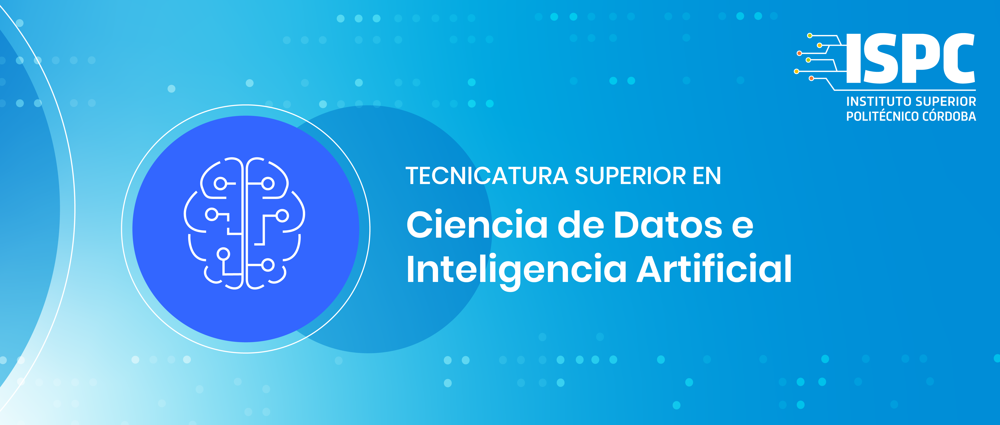
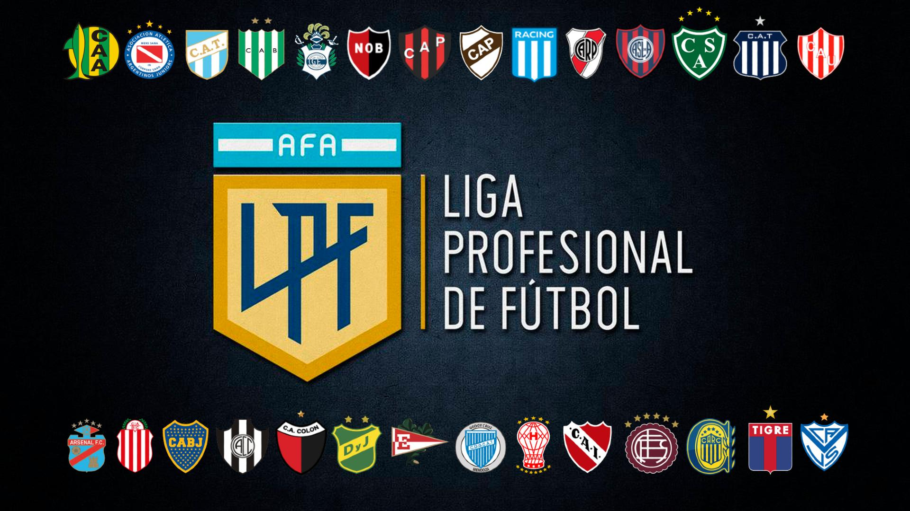

## Proyecto Integrador 2022 - Proyecto Gamma

# Grupo OOOP3

### **Tema:**

- ## _Resultados torneo argentino de futbol (temporada 2022)_
  

#

### **Herramientas a utilizar:**

- _Python_ _(web scraping, gestion de BBDD, visualización de de tablas con la libreria Pandas y graficos con Plotly Dash)_

  

  

  

- _SQLite (BBDD)_

  

#

### **Participantes:**

- _Octtinger Martina_ - martiocttinger@gmail.com
- _Oller Martin Ariel_ - martinoller@hotmail.com
---

## Instrucciones

```
$ git clone https://github.com/ispc-programador2022/OOOP3.git
$ cd ../path/to/the/file
$ pip install -r requirements.txt 
$ python main.py
```
